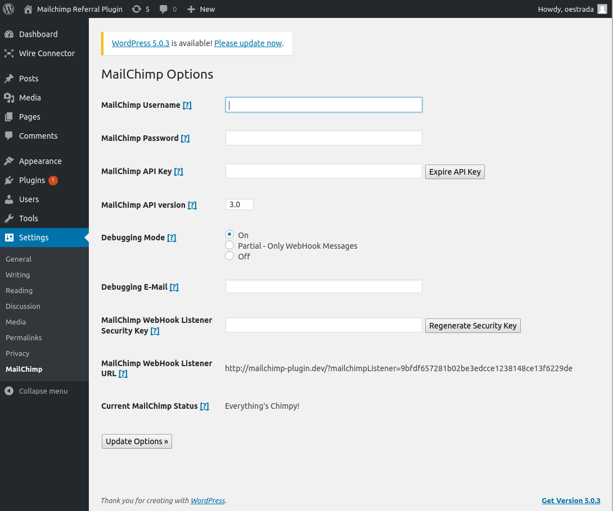
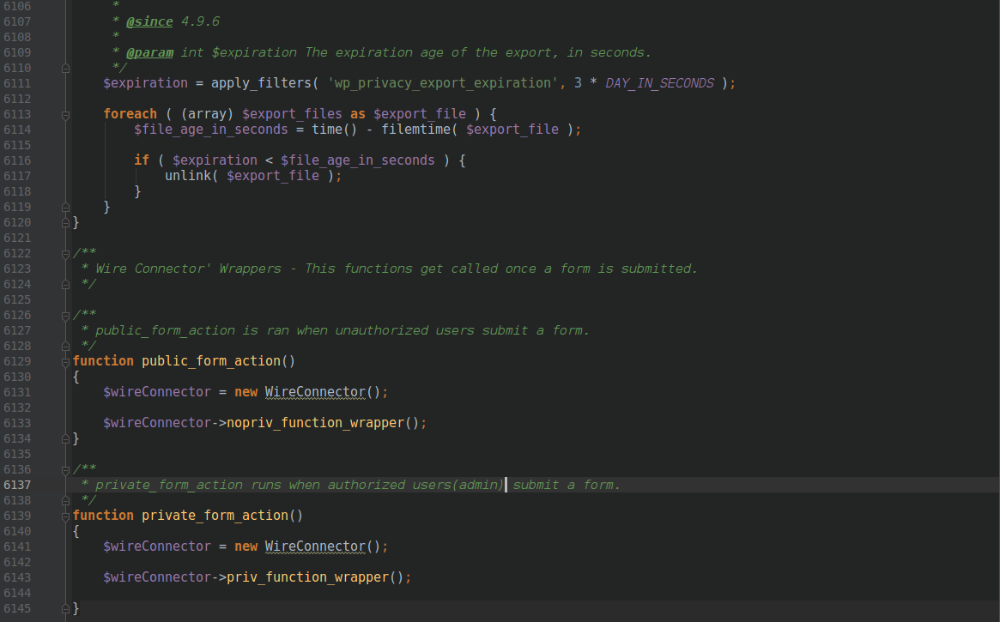
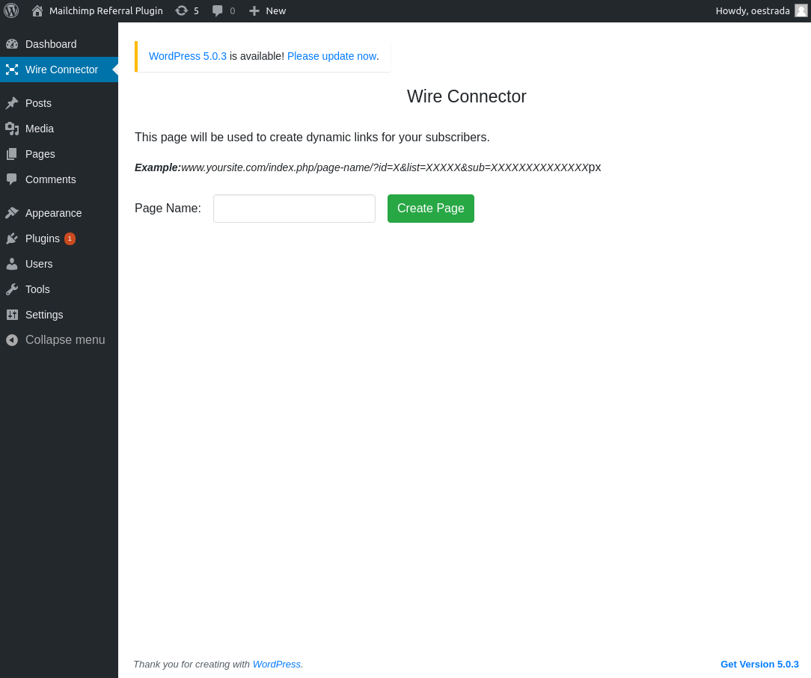

# Wire Connector

Contributors: Oscar Estrada<br>
Special Thank you To: Aaron D. Campbell(Mailchimp Framework), Drew McLellan(Mailchimp API) <br>
Tags: Mailchimp, Email Campaign, Affiliate Marketing, Referral Marketing<br>
Requires at least: 5.0.1<br>
Requires PHP: 5.0+<br>
License: GPLv2<br>

Wire Connector allows you to implement a referral/affiliate program using your Mailchimp account.

### Description

Wire Connector allows you to use your Mailchimp account to create a Referral/Affiliate Program. Wire Connector used the Mailchimp API to communicate with your Mailchimp Account. Merging WP and Mailchimp allows us to capture data using WP and inputting it into Mailchimp\'s Merge Fields which allows us to hold unique data regarding a specific subscriber. Using Mailchimp to hold our data regarding our subscribers allows us to use the analytic features Mailchimp has to offer with email campaign marketing, it allows us to use personalized data for each subscriber by using Mailchimp\'s Merge Fields, and last but not least, using Mailchimp allows us to keep the cost low..FREE.<br>
Surely with all the great stuff, there must be some bad things about using Mailchimp, right?<br>

Well, there sure is. For starters, it is not the best way to store data in a database which doesn\'t allow you to a create relationships between certain data in order to improve speed.

## Installation

Need help installing the plugins? [Click here](https://codex.wordpress.org/Managing_Plugins)

After installing the Wire Connector Plugin:
1. Navigate to Mailchimp Settings under the Settings tab on the admin dashboard.
2. Add your credentials. That includes:
    * Mailchimp Email
    * Mailchimp Password
    * Mailchimp API key.
        * Need help finding your API keys? [Click Here](https://mailchimp.com/help/about-api-keys/#Find_or_Generate_Your_API_Key)
3. Add the following lines of code at the end of your functions.php file:

```php
function public_form_action()
{
    $wireConnector = new WireConnector();

    $wireConnector->nopriv_function_wrapper();
}

function private_form_action()
{
    $wireConnector = new WireConnector();

    $wireConnector->priv_function_wrapper();

}

```
4 . On the admin dashboard, click on the Wire Connector tab and start the process!


### Screenshots
1. Configuring the Mailchimp Settings

2. Adding the wrappers to the functions.php file

3. Starting Wire Connector


#### Changelog

= 1.0 =

2/14/2019 - Initial Upload

= 1.1 =

6/11/2019 - Separated concerns with classes and implemented Mail, Mailchimp Lists, and Goals and Prizes Settings.